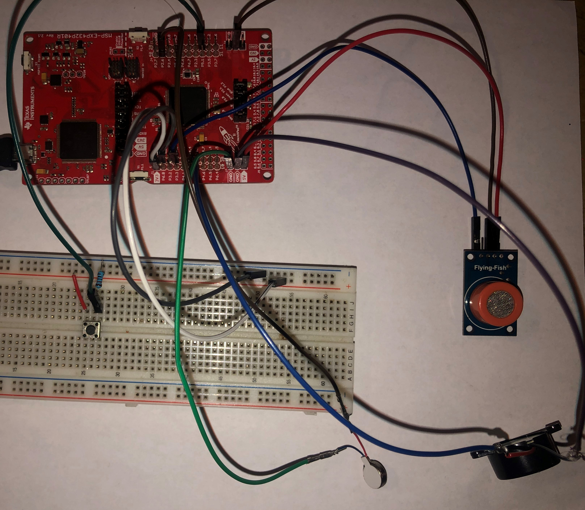

# **Single Channel :zap:**

## **Description**
The following program will emulate a breathalyzer using the MSP432. Some of the peripherals used in this system are the following: Analog-to-Digital Converter, Timer A, Port Interrupts and General Purpose Input and Outputs. The system starts the moment that the Port interrupt is press allowing the Timer to run for 10 seconds. During the 10-second window the system will read from the sesnor using ADC. If the is no reading detected, nothing will happen and the system will wait for the Port Interrupt to be pressed. However, if there is a reading the system will activate the GPIO and on-board to indicate that the reading surpasses the threshold. 

## **Pinout**

- Texas Instrument
## **References**
Here are some references of how to use the peripherals for the MSP432:  
* [Analog-to-Digital Converter](https://github.com/jminjares4/MSP432-Example-Codes/tree/main/Analog%20to%20Digital%20Converter%20(ADC))
* [Timer A](https://github.com/jminjares4/MSP432-Example-Codes/tree/main/TimerA)
* [Port Interrupts](https://github.com/jminjares4/MSP432-Example-Codes/tree/main/Port%20Interrupts)
* [General Purpose Input and Output](https://github.com/jminjares4/MSP432-Example-Codes/tree/main/General%20Purpose%20Input%20and%20Output%20(GPIO))
## **Hardware**

  
    * Breathalyzer circuit

## **Author** 
- [Jorge Minjares](https://github.com/JorgeMinjares) :zap:
    - Bachelor of Science in Electrical Engineering